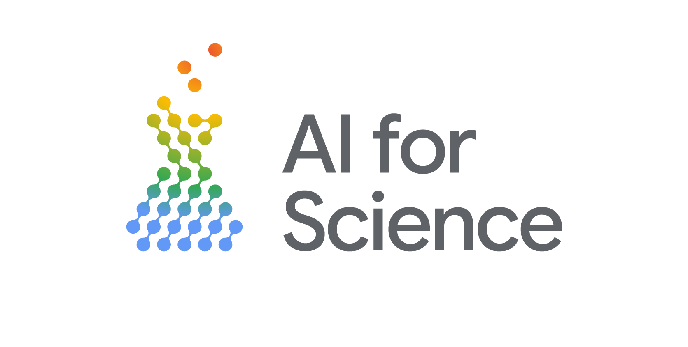

The [Centre for AI, Trust & Governance (CAITG) AI Winter School](https://www.sydney.edu.au/arts/our-research/centres-institutes-and-groups/centre-for-ai-trust-and-governance.html) is an immersive four-day program hosted at the University of Sydney. Designed for graduate students, postdoctoral scholars, and early career researchers across all disciplines. The AI Winter School will provide practical training in state-of-the-art AI tools, research applications, ethical frameworks, and responsible practice.

The [Google Developer Group AI for Science](https://gdg.community.dev/gdg-ai-for-science-australia/) is running an AI Masterclass on day two of the School.

## AI Masterclass: Accelerating Research with Trusted AI
Designed for researchers and professional staff, this full-day hands-on workshop will empower you to integrate advanced AI capabilities into your workflows. You will quickly advance from foundational Python integrations to building robust AI systems you can reuse for your own work. You will learn to construct secure Retrieval-Augmented Generation (RAG) pipelines, develop intelligent autonomous agents, and apply modern computer vision techniques to research data, all while considerate of data privacy and governance standards.

### Session 1: AI Foundations
We will explore the fundamental concepts required for AI-powered research. Starting with a frictionless technical setup using Google Colab and Google AI Studio, you will learn how to seamlessly integrate machine learning and Python with the Gemini API. 

### Session 2: Customising LLMs: Fine-Tuning vs. RAG
Unlock the power of Large Language Models on your own private, domain-specific data. We will unpack the critical differences between model Fine-Tuning and Retrieval-Augmented Generation (RAG). You will gain practical experience in tailoring LLMs to securely interrogate custom knowledge bases, ensuring your AI outputs remain accurate, verifiable, and aligned with your data.

### Session 3: Building AI Agents for Research
In this session, you will learn how to equip AI agents with the specific tools and skills they need to automate complex workflows (such as literature aggregation, data processing, and API calling). We will build intelligent agents that do useful heavy lifting while maintaining vital human-in-the-loop oversight.

### Session 4: Multimodal AI & Applied Computer Vision
Explore modern approaches to visual data in research. We will dive into computer vision, focusing on object detection and semantic segmentation. You will understand the underlying mechanics of different segmentation approaches, identify key research use cases (from satellite imagery to biomedical scans), and learn how to leverage multimodal models to extract rich, actionable insights from complex visual datasets.

## Register

Register for the series at the [CAITG AI Winter School](https://www.sydney.edu.au/arts/our-research/centres-institutes-and-groups/centre-for-ai-trust-and-governance/caitg-ai-winter-school-2026.html)

Join the community (in [Australia](https://gdg.community.dev/gdg-ai-for-science-australia/), [Korea](https://gdg.community.dev/gdg-ai-for-science-korea/), [Japan](https://gdg.community.dev/gdg-ai-for-science-japan), or [India](https://gdg.community.dev/gdg-ai-for-science-india/)) for talks, events, collaborations and more.

## When 

Jul 28, 9:00 AM – 5:00 PM

## Target Audience

This workshop is aimed at anyone looking to accelerate their research with AI including:

* Research students (undergrad, masters, PhD, etc)
* Researchers requiring AI tools
* Data Scientists and professionals supporting scientific projects

Use cases will be grounded in typical scientific workloads. 

## Requirements

* A Google account to use Google Colab, Kaggle, AI Studio, and Antigravity.
* Basic familiarlity with Python. 

